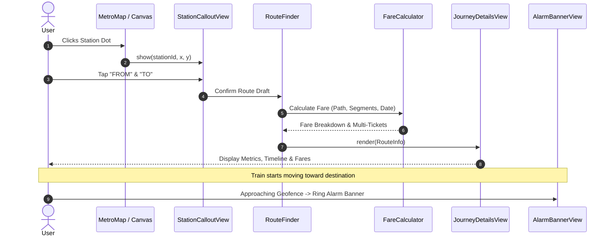

# 🚇 Client App Documentation: Home Page, Interactive Map & Route Finder (`index.html`)

> **Location:** `main_project/index.html`  
> **Primary Script:** `main_project/js/pages/home.js` (`HomePageController`)  
> **Status:** Production-Ready / Enterprise OOP Architecture  

---

## 1. Overview & Architecture Blueprint

The Home Page is the central cockpit of the Metro Map & Route Finder application (`YatraMarg`). It integrates the high-performance SVG canvas map, fuzzy-search route engine, multi-operator dynamic fare calculation system, multi-tab settings suite, and real-time transit telemetry widgets.

```
                              ┌─────────────────────────────────────────┐
                              │           HomePageController            │
                              └────────────────────┬────────────────────┘
                                                   │
          ┌──────────────────────┬─────────────────┴─────────────────┬──────────────────────┐
          ▼                      ▼                                   ▼                      ▼
┌───────────────────┐  ┌───────────────────┐               ┌───────────────────┐  ┌───────────────────┐
│     MetroMap      │  │StationCalloutView │               │    RouteFinder    │  │   SettingsView    │
│  (SVG Engine &    │  │ (Canvas Station   │               │ & Dijkstra Engine │  │ (4-Folder Tabs:   │
│   Map Legend)     │  │   Draft Pins)     │               └─────────┬─────────┘  │ Alarm, Map, Packs,│
└───────────────────┘  └───────────────────┘                         │            │ Backup / Restore) │
          │                                                          ▼            └───────────────────┘
          │                                                ┌───────────────────┐            │
          ▼                                                │  FareCalculator   │            ▼
┌───────────────────┐                                      │ (Multi-Leg & Merge│  ┌───────────────────┐
│ Widgets & Banners │                                      │   Fare Engine)    │  │RecentSearchesView │
│ (Speedometer,     │                                      └─────────┬─────────┘  │(Recent, Most Used,│
│  GPS Telemetry,   │                                                ▼            │     A-Z Chips)    │
│  Alarm Banner)    │                                      ┌───────────────────┐  └───────────────────┘
└───────────────────┘                                      │JourneyDetailsView │
                                                           │ (Metrics, Timeline│
                                                           │  & Selectable Fare│
                                                           └───────────────────┘
```

---

## 2. Core Components & Responsibilities

### 2.1 `HomePageController` (`js/pages/home.js`)
- **Lifecycle Management:** Orchestrates initialization of `MetroMap`, `RouteFinder`, `JourneyDetailsView`, `RecentSearchesView`, `StationCalloutView`, `SettingsView`, `AlarmBannerView`, `SpeedometerWidget`, and `TelemetryWidget`.
- **Smart Auto-Fill:** Reads `CenterClass.getRecentSearches()` to pre-fill the last searched route for immediate view upon reload.
- **Deep Linking:** Evaluates URL query parameters (`?from=...&to=...&routeType=...`) and binds to the native Android Deep Link event bus.
- **Fuzzy Search Autocomplete:** Binds input listeners with typo-tolerant prefix/substring matching and instant keyboard navigation (Arrow Up/Down, Enter).
- **Station Swap (⇄):** Inverts `startStation` and `endStation` values with animation and re-triggers route planning.

---

### 2.2 Interactive SVG Map (`js/components/metro-map.js`)
- **Canvas Rendering:** Dynamic multi-layered SVG containing:
  - `tracks_lineGroup`: Curved or straight path tracks with operator-specific stroke colors and styles (solid, dashed, dotted).
  - `stations_circleGroup`: Station nodes color-coded by interchange status and state.
  - `labelGroup`: Multilingual localized station labels with geometric collision bounding.
  - `routePins`: Start (▲) and Destination (▼) marker pins.
- **Pan, Zoom & Pinch Gesture Handling:** Matrix-based viewport transformation with smooth physics (`requestAnimationFrame`).
- **Interactive Legend (`#legendGenerator`):**
  - **Lines Filter:** Clickable line badges that isolate and highlight specific rail corridors.
  - **Station Types:** Distinguishes normal stations, walkway interchange hubs, multimodal transfer nodes, shared tracks, and terminal stations.
  - **Status Categories:** Operational (solid line), Under Construction (dashed line), Approved & Planned (dotted line).

---

### 2.3 Direct Station Canvas Selection (`js/components/StationCalloutView.js`)
- **Canvas Interaction:** Clicking any station dot on the SVG canvas spawns a floating callout card anchored to the station coordinates.
- **Station Info Access:** Direct link to `station_info.html?id=<id>&city=<city>` for in-depth platform, gate, and facilities information.
- **Direct Route Drafting:**
  - **FROM (▲) Button:** Assigns station as journey origin and places origin pin.
  - **TO (▼) Button:** Assigns station as journey destination and places destination pin.
  - **Auto-Confirm Prompt:** When both points are set via canvas clicks, prompts the user to find route immediately without opening the sidebar search box.

---

### 2.4 Route Engine & Dynamic Fare Engine
#### Routing (`js/services/route/RouteFinder.js` & `DijkstraAlgo.js`)
- **Weighted Dijkstra Graph:** Edge weights calculated based on distance, train speed, interchange transfer penalties, and turnaround buffers.
- **Priority Modes:**
  - **Shortest (Fastest):** Minimizes total travel minutes, prioritizing express lines even if extra transfers are needed.
  - **Less Interchange:** Applies severe penalty to line transfers, prioritizing single-line comfort.

#### Universal Fare Calculator (`js/services/fare/FareCalculator.js`)
Supports 4 pluggable fare models:
1. `distance_based`: Progressive distance slabs (e.g., 0-2 km: ₹10, 2-5 km: ₹20, etc.).
2. `station_pair` / `matrix_based`: Direct 2D point-to-point price lookup tables.
3. `station_count_based`: Slabs calculated from total intermediate stations crossed.
4. `flat_rate`: Fixed ticket price.

#### Multi-Network Operator Merging:
- **Leg Grouping (`#groupSegmentsIntoLegs`):** When crossing disparate transit operators (e.g. DMRC to Rapid Metro Gurgaon, DMRC to Namo Bharat RRTS, or Mumbai Metro Line 1 to Maha Metro), the engine identifies multimodal interchange nodes and walkways.
- **Multi-Ticket Breakdown:** Computes individual ticket prices per leg, smart card discounts, off-peak/peak hours, and Sunday/gazetted holiday discounts.
- **Coach Class Multipliers:** Standard vs Premium coach fares (e.g. RRTS Namo Bharat).
- **Grand Total Calculation:** Aggregates multi-leg tickets into a unified journey cost with active time slot indicators.

---

### 2.5 Route Results UI (`js/components/JourneyDetailsView.js`)
- **Quick Metrics:** Distance (km), Travel Time (minutes), Station Count, Line Changes.
- **Timetable Schedulers:** First Train (☀️) and Last Train (🌙) timings for origin station.
- **Selectable Fare Cards:** Interactive pills allowing users to switch between standard and premium fares or see discount percentages with an "Active Now" indicator.
- **Step-by-Step Timeline:** Intermediate stations expand/collapse drawer, interchange walkway walking distance/time warnings, platform indicators.

---

### 2.6 Multi-Folder App Settings (`js/components/SettingsView.js`)
- **Tab 1: Alarm & Telemetry (अलार्म)**
  - *Trigger Geofence:* 1 Station Before (Proximity), 200m, 500m (Recommended), 1.0 km, 2.0 km.
  - *Destination & Interchange Toggles:* Dedicated switches for terminus alert and transfer station alerts.
  - *Sound Synthesizer:* Metro Chime, Pulsed Warning Beep, Emergency Siren, or Custom MP3 upload.
  - *Volume & Vibration:* 0-100% volume slider with sound test; Long, Short, SOS, Continuous haptic patterns with vibration test.
  - *Offline TTS (Voice Announcements):* SpeechSynthesis API for announcing upcoming stations without data connectivity.
- **Tab 2: Map Display (मैप सेटिंग्स)**
  - Toggles for displaying/hiding dashed under-construction corridors and dotted approved/planned lines.
- **Tab 3: Backup & Restore (डेटा बैकअप)**
  - JSON-based full backup export, Web Share API integration, and file import parser for user preferences and saved routes.
- **Tab 4: Packs Manager (थीम व भाषा पैक्स)**
  - Offline language packs and theme packs management for PWA and Capacitor containers.

---

### 2.7 Transit Telemetry & Live Speedometer
- **`WidgetSpeedometer.js`:** Real-time speed rendering in km/h, top speed tracker, GPS accuracy gauge, and motion state classifier (`HALTED`, `MOVING`, `CRUISING`).
- **`WidgetTelemetry.js`:** Satellite signal lock strength (🟢 80-100%, 🟡 40-79%, 🔴 In Tunnel Dead-Reckoning Timer Fallback, 📵 GPS Off, 🚫 Blocked Permission), mobile network status, precision radius (±X m), and contextual Guide Popover.
- **`AlarmBannerView.js`:** Floating pill that renders automatically upon approaching target station with Dismiss, Snooze (5 mins), and Stop controls.

---

## 3. Data Flow & Integration Contract



---

## 4. Internationalization & Accessibility Standard
- **Zero Hardcoded Text:** All labels, placeholders, aria attributes, and status tags are driven by `i18n.t()`.
- **High Contrast & Dark Mode:** Handled via CSS variables linked to the `ThemeEngine`.
- **Keyboard & Screen Reader:** Full ARIA role definitions (`role="region"`, `role="tablist"`, `aria-live="polite"`), skip links, and semantic `<fieldset>` structures.
