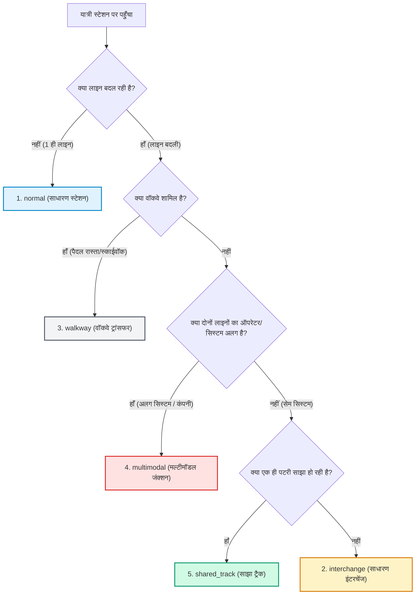

# 🚉 स्टेशन और कनेक्शन प्रकार (Station & Connection Taxonomy)

> **दस्तावेज़ का उद्देश्य:**  
> यह दस्तावेज़ पूरे भारत के किसी भी मेट्रो या रेल नेटवर्क के लिए **5 सार्वभौमिक कनेक्शन प्रकारों (5 Universal Connection Types)** का आधिकारिक संदर्भ (Reference Guide) है। इसके माध्यम से रूटिंग, फेयर इंजन और नक्शा (SVG Map) तीनों बिना किसी हार्डकोडिंग के पूरी तरह डायनामिक तरीके से काम करते हैं।

---

## 📑 1. 5 सार्वभौमिक कनेक्शन प्रकार (Universal Types Table)

| # | कनेक्शन प्रकार (Key) | असली दुनिया की स्थिति | नक्शे पर सिंबल (UI) | किराये और टिकटिंग का नियम | सुरक्षा जांच व गेट | असली उदाहरण |
| :-: | :--- | :--- | :---: | :--- | :--- | :--- |
| **1** | **`normal`** (साधारण स्टेशन) | केवल 1 ही लाइन गुजरती है। कोई ट्रेन नहीं बदलनी। | छोटा सॉलिड डॉट (Small Dot) | **सिंगल टिकट:** शुरुआती से अंतिम स्टेशन तक दूरी का एक ही स्लैब। | कोई अलग गेट नहीं। | **झिलमिल**, **साकेत**, **मॉडल टाउन** |
| **2** | **`interchange`** (सेम-सिस्टम इंटरचेंज) | स्टेशन के अंदर ही सीढ़ी/एस्केलेटर से दूसरी लाइन बदलना (सेम ऑपरेटर/कंपनी)। | ⭕ खाली गोल रिंग *(Open Circle)* | **कोई नई टिकट नहीं:** पूरी यात्रा की कुल दूरी जुड़ती है और एक ही किराया लगता है। | पेड एरिया के अंदर ही ट्रांसफर। दोबारा चेकिंग नहीं। | **राजीव चौक** (येलो ↔ ब्लू) **कश्मीरी गेट** (रेड ↔ येलो ↔ वायलेट) |
| **3** | **`walkway`** (पैदल वॉकवे / स्काईवॉक) | स्टेशन की इमारत से बाहर निकलकर सड़क पार करना या लंबा स्काईवॉक चलना। | ⚫ भरा हुआ काला गोला *(Solid Circle)* | **दूरी/समय नियम:** • यात्रा समय में पैदल चलने का समय जुड़ता है (~4-8 मिनट)। • यदि कंपनी अलग है तो 2 अलग टिकट लगेंगी। | यदि बाहर निकलना पड़े तो दोबारा गेट पंच हो सकता है। | **नोएडा सेक्टर 52 ↔ 51** (300m वॉकवे) **धौला कुआँ ↔ साउथ कैंपस** (1km स्काईवॉक) |
| **4** | **`multimodal`** (मल्टीमॉडल जंक्शन) | जहाँ दो अलग-अलग सिस्टम या कंपनियां मिलती हैं (जैसे मेट्रो + रीजनल ट्रेन RRTS, मेट्रो + एयरपोर्ट एक्सप्रेस, मेट्रो + रेलवे)। | 🔴+🟠 डबल रंग वाला रिंग *(Dual Ring)* | **स्प्लिट फेयर (Split Fare):** • दोनों कंपनियों का किराया अलग-अलग जुड़ता है (2 टिकट)। • RuPay NCMC कार्ड दोनों गेट्स पर सीधे मान्य है। | **अलग गेट** और **दोबारा सुरक्षा जांच (Fresh Security Check)**। | **आनंद विहार** (मेट्रो ↔ नमो भारत) **नई दिल्ली** (मेट्रो ↔ एयरपोर्ट लाइन ↔ रेलवे) |
| **5** | **`shared_track`** (साझा ट्रैक) | जहाँ दो अलग-अलग सेवाएं एक ही भौतिक पटरी (Physical Track) साझा करती हैं। | 🛤️ साझा ट्रैक सिंबल *(Parallel Lines)* | **पॉलिसी के अनुसार:** उसी प्लेटफॉर्म से यात्री लोकल या एक्सप्रेस ट्रेन चुन सकता है। किराया चुनी गई ट्रेन का लगेगा। | सेम प्लेटफॉर्म, कोई सुरक्षा जांच नहीं। | **मेरठ में नमो भारत + मेरठ मेट्रो** *(मेरठ साउथ से मोदीपुरम तक एक ही पटरी पर)* |

---

## 🌳 2. कनेक्शन डिटेक्शन फ़्लोचार्ट (Decision Tree)

इंजन बिना किसी स्टेशन या शहर का नाम जाने, डेटा के आधार पर खुद तय करता है कि कनेक्शन इन 5 में से कौन सा है:

---

## ⚙️ 3. सिस्टम में इन प्रकारों का उपयोग

### A. रूटिंग इंजन (`RouteFinder.js` & `DijkstraAlgo.js`)
* `walkway`: पैदल चलने की दूरी के आधार पर मानवीय चाल (80 मीटर/मिनट) से अतिरिक्त ट्रांसफर समय जोड़ता है।
* `interchange`: न्यूनतम लाइन परिवर्तन (Least Transfers) प्राथमिकता के तहत 1 ट्रांसफर जोड़ता है।
* `multimodal`: यात्रा को अलग-अलग टिकटिंग खंडों (Legs) में विभाजित करने का संकेत देता है।

### B. फेयर कैलकुलेटर (`FareCalculator.js`)
* `interchange`: पूरी दूरी को एक मानकर सिंगल फेयर स्लैब लागू करता है।
* `multimodal`: दोनों कंपनियों/लाइनों का किराया अलग-अलग जोड़ता है और यूजर को **🛡️ सुरक्षा जांच** व **💳 NCMC कार्ड** का अलर्ट देता है।
* `walkway`: दोनों कंपनियों के अलग होने पर स्प्लिट टिकट लागू करता है।

### C. स्क्रीन डिस्प्ले (`JourneyDetailsView.js`)
* यदि यात्रा में केवल `normal` या `interchange` है ➔ स्क्रीन पर केवल 2-रो का साधारण कार्ड दिखता है।
* यदि यात्रा में `multimodal` या पेड `walkway` है ➔ स्क्रीन पर **[ ℹ️ टिकट्स ब्रेकडाउन देखें ▾ ]** बटन आता है और हर हिस्से का 4-कॉलम विवरण खुलता है।
