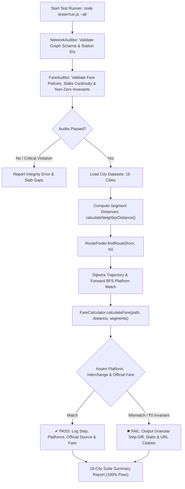

# 🧪 Universal Gray-Box Testing Harness, Route/Platform & Official Fare Verification Engine

> **Core Philosophy:** "Zero JS Patches, 100% Graph Correctness, Strict OOP Modular Architecture & Authoritative Ground-Truth Validation"  
> **Source Directory Authority:** `tester/`  
> **System Under Test (SUT):** `main_project/js/services/route/`, `main_project/js/services/fare/` & `main_project/data/india/cities/`

---

## 🗺️ Architectural Ecosystem Diagram

```
                               ┌─────────────────────────────────────────┐
                               │           TESTER CLI HARNESS            │
                               │             (tester/run.js)             │
                               │  • CLI Flags: --all, --city=, --audit   │
                               │  • High-Precision Timing Analytics     │
                               └────────────────────┬────────────────────┘
                                                    │
                 ┌──────────────────────────────────┼──────────────────────────────────┐
                 │                                  │                                  │
                 ▼                                  ▼                                  ▼
  ┌─────────────────────────────┐    ┌─────────────────────────────┐    ┌─────────────────────────────┐
  │   1. DATA INTEGRITY AUDIT   │    │   2. FARE POLICY & SLABS    │    │ 3. ROUTE, PLATFORM & FARE   │
  │ (tester/engine/NetworkAuditor)   │ (tester/engine/FareAuditor) │    │  (tester/engine/TestRunner) │
  ├─────────────────────────────┤    ├─────────────────────────────┤    ├─────────────────────────────┤
  │ • Canonical Station IDs     │    │ • Non-Zero Tariff Rule Check│    │ • Step-by-Step Path Check   │
  │ • Platform Dest Validation  │    │ • Policy Continuity & Gaps  │    │ • Exact Platform Number     │
  │ • Disconnected Node Alerts  │    │ • Slabs Overlap Invariant   │    │ • Official Fare Benchmark   │
  │ • Route Endpoint Checking   │    │ • Missing Policy Detection  │    │ • ₹0 Fare Invariant Guard   │
  └──────────────┬──────────────┘    └──────────────┬──────────────┘    └──────────────┬──────────────┘
                 │                                  │                                  │
                 └──────────────────────────────────┼──────────────────────────────────┘
                                                    │
                                                    ▼
                                     ┌─────────────────────────────┐
                                     │       PRODUCTION SUT        │
                                     │  • RouteFinder.js           │
                                     │  • FareCalculator.js        │
                                     │  • calculateNeighborDistance│
                                     └──────────────┬──────────────┘
                                                    │
                                                    ▼
                                     ┌─────────────────────────────┐
                                     │    16 GOLDEN CITY DATASETS  │
                                     │  (tester/datasets/*.cases)  │
                                     │  • Official Metro Govt URLs │
                                     │  • Notification Citations   │
                                     └─────────────────────────────┘
```

---

## 🔄 Mermaid Flowchart: Platform Determination & Fare Verification Cycle



---

## 🛡️ Core Testing Principles & Design Constraints

### 1. 🚫 Zero JS Patches & Strict OOP Architecture
- **No Hacks:** कोई भी हार्डकोडेड `if-else` या स्टेशन-स्पेसिफिक पैच नहीं।
- **Code Reuse:** प्रोडक्शन के मुख्य इंजनों (`RouteFinder`, `FareCalculator`, `calculateNeighborDistance`) को सीधे रीयूज किया जाता है।
- **OOP Encapsulation:** सभी ऑडिटर्स और रनर क्लासेस ES2022 प्राइवेट फील्ड्स (`#`) और मेथड्स के साथ मॉड्युलर हैं।
- **No Monolith:** प्रत्येक शहर का डेटासेट स्वतंत्र फाइल में अलग रखा गया है (`tester/datasets/<city>.cases.js`)।

### 2. 💰 Automated Fare Validation & Official Ground-Truth
- **₹0 Fare Invariant Guard:** अलग-अलग स्रोत और गंतव्य स्टेशनों के बीच का किराया कभी भी ₹0 नहीं हो सकता (यह मिसिंग `farePolicy` या टूटे हुए स्लैब का संकेत देता है)।
- **Slab Continuity & Policy Check:** `FareAuditor` पुष्टि करता है कि हर लाइन का वैध `farePolicy` मैप है, कोई स्लैब ओवरलैप नहीं है और न्यूनतम स्लैब वैध है।
- **Official Truth & Government Citations:** प्रत्येक टेस्ट केस में आधिकारिक मेट्रो ऑपरेटर की वेबसाइट और अधिसूचना संदर्भ (`sourceVerification.officialUrl`, `notificationRef`) शामिल हैं।
- **Hops vs Station Count Resolution:** `station_count_based` सिस्टम (BMRCL, UPMRC, JMRC) में स्टेशनों की संख्या को `Math.max(1, path.length - 1)` (यात्रा किए गए स्टेशन/हॉप्स) के आधार पर सत्यापित किया गया है।

### 3. ⚡ Sub-Millisecond Execution Speed
- पूरा टेस्ट सूट Node.js ES2022 नेटिव मॉड्यूल्स पर चलता है।
- **16 शहरों के सभी 69 टेस्ट लगभग 15-30ms में** 100% शुद्धता के साथ निष्पादित होते हैं।
- CI/CD पाइपलाइन, प्री-कमिट हुक या लोकल डेवलपमेंट में बिना किसी लैग के चलाया जा सकता है।

---

## 🇮🇳 Comprehensive 16 Indian Cities Coverage

वर्तमान में टेस्ट हार्नेस भारत के सभी 16 मेट्रो शहरों को कवर करता है:

| # | शहर (City Key) | मेट्रो नेटवर्क / प्राधिकरण | टेस्ट केस प्रकार |
|---|---|---|---|
| 1 | `delhi_ncr` | DMRC, NMRC (Aqua), Rapid Metro Gurgaon, Namo Bharat RRTS | रूट, मल्टी-लाइन इंटरचेंज, प्लेटफॉर्म्स |
| 2 | `bengaluru` | BMRCL (Namma Metro - Purple, Green) | 2026 स्टेशन-काउंट स्लैब्स, इंटरचेंज, मैक्सिमम कैप |
| 3 | `mumbai` | MMOPL (Line 1), MMMOCL (Line 2A, Line 7), MMRC (Line 3 Aqua), MMRDA Monorail, Navi Mumbai Metro | प्लेटफॉर्म्स, सस्पेंडेड लाइन्स, इंटरचेंज, दूरी स्लैब्स |
| 4 | `kolkata` | Metro Railway Kolkata (Blue, Green Line) | आधिकारिक 2019 रेलवे दूरी-आधारित स्लैब्स |
| 5 | `chennai` | CMRL (Blue, Green Line) | एयरपोर्ट डायरेक्ट कॉरिडोर, न्यूनतम किराया |
| 6 | `hyderabad` | L&T Metro Rail Hyderabad (HMRL - Red, Blue, Green) | 2025-2026 संशोधित दूरी स्लैब्स |
| 7 | `ahmedabad_gandhinagar` | GMRC (Gujarat Metro - North-South, East-West) | न्यूनतम और दूरी-आधारित स्लैब्स |
| 8 | `pune` | Maha Metro Pune (Purple, Aqua Line) | 0-2 किमी एवं 4-6 किमी दूरी स्लैब्स |
| 9 | `nagpur` | Maha Metro Nagpur (Orange, Aqua Line) | न्यूनतम किराया, एडजसेंट स्टेशन दूरी स्लैब्स |
| 10 | `kochi` | KMRL (Kochi Metro Line 1) | न्यूनतम एवं 2-5 किमी स्लैब्स |
| 11 | `lucknow` | UPMRC (Lucknow Metro Red Line) | 1 स्टेशन, 2 स्टेशन एवं 7-9 स्टेशन स्लैब्स |
| 12 | `jaipur` | JMRC (Jaipur Metro Pink Line) | 0-2 स्टेशन, 7-8 स्टेशन, 9-10 स्टेशन स्लैब्स |
| 13 | `kanpur` | UPMRC (Kanpur Metro Orange Line) | 1 हॉप (₹10), 2 हॉप्स (₹15), 7-9 स्टेशन (₹30) |
| 14 | `agra` | UPMRC (Agra Metro Yellow Line) | 1 हॉप (₹10), 2 हॉप्स (₹15), प्रायोरिटी कॉरिडोर (₹20) |
| 15 | `bhopal` | MPMRCL (Bhopal Metro Orange Line) | 0-2 किमी एवं 2-5 किमी स्लैब्स |
| 16 | `indore` | MPMRCL (Indore Metro Yellow Line) | सुपर कॉरिडोर न्यूनतम एवं 4-हॉप स्लैब्स |

---

## 💻 CLI Commands & Usage

### 1. डिफ़ॉल्ट रन (Delhi NCR):
```powershell
node tester/run.js
```

### 2. विशिष्ट शहर का टेस्ट चलाना (`--city=<city_id>`):
```powershell
# Bengaluru (Namma Metro)
node tester/run.js --city=bengaluru

# Mumbai Metro & Monorail
node tester/run.js --city=mumbai

# Kanpur / Lucknow / Jaipur
node tester/run.js --city=kanpur
node tester/run.js --city=lucknow
node tester/run.js --city=jaipur
```

### 3. सभी 16 शहरों का मास्टर टेस्ट रन (`--all`):
```powershell
node tester/run.js --all
```

### 4. केवल डेटा एवं किराया पॉलिसी ऑडिट रिपोर्ट देखना:
```powershell
node tester/run.js --audit
```

---

## 📁 Tester Directory Structure

```
tester/
│
├── engine/
│   ├── TestRunner.js          # ANSI colored assertion engine, diff reporter, fare & platform check
│   ├── NetworkAuditor.js      # Structural graph & canonical station ID validator
│   └── FareAuditor.js         # Fare policy completeness, slab continuity & zero-fare invariant auditor
│
├── datasets/                  # Modular per-city golden datasets
│   ├── agra.cases.js
│   ├── ahmedabad_gandhinagar.cases.js
│   ├── bengaluru.cases.js
│   ├── bhopal.cases.js
│   ├── chennai.cases.js
│   ├── delhi_ncr.cases.js
│   ├── hyderabad.cases.js
│   ├── indore.cases.js
│   ├── jaipur.cases.js
│   ├── kanpur.cases.js
│   ├── kochi.cases.js
│   ├── kolkata.cases.js
│   ├── lucknow.cases.js
│   ├── mumbai.cases.js
│   ├── nagpur.cases.js
│   └── pune.cases.js
│
├── package.json               # ES Module declaration ("type": "module")
└── run.js                     # Master CLI entry point & orchestrator
```

---

## 📝 How to Add New Test Cases

किसी भी नए शहर या रूट का टेस्ट केस जोड़ने के लिए संबंधित `tester/datasets/<city>.cases.js` फाइल में नया ऑब्जेक्ट जोड़ें:

```javascript
{
    id: "KNP-01",
    desc: "IIT Kanpur to Kalyanpur Metro (Adjacent station - 1 hop)",
    from: "iit_kanpur",
    to: "kalyanpur_metro",
    sourceVerification: {
        officialUrl: "https://www.upmetrorail.com",
        notificationRef: "UPMRC Kanpur Fare Notification - 1 Station Slab",
        notes: "1 station traveled = ₹10 base fare."
    },
    expectedFare: 10,
    expectedInterchanges: 0,
    expectedPlatforms: [
        { atStation: "iit_kanpur", line: "upmrc_kanpur.orange", platform: "__" }
    ]
}
```
