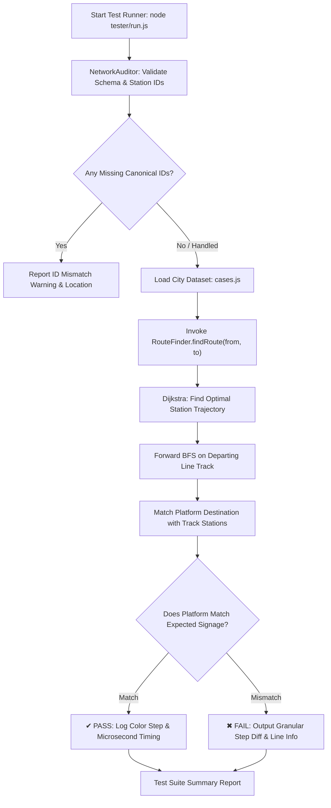

# 🧪 Universal Gray-Box Testing Harness & Route/Platform Verification Engine

> **Core Philosophy:** "Zero JS Patches, 100% Graph Correctness, Authoritative Ground-Truth Validation"  
> **Source Directory Authority:** `tester/`  
> **System Under Test (SUT):** `main_project/js/services/route/` & `main_project/data/cities/`

---

## 🗺️ Architectural Ecosystem Diagram

```
                               ┌─────────────────────────────────────────┐
                               │           TESTER CLI HARNESS            │
                               │             (tester/run.js)             │
                               │  • CLI Flags: --all, --city=, --audit   │
                               │  • High-Precision Timing Analytics     │
                               └────────────────────┬────────────────────┘
                                                    │
                 ┌──────────────────────────────────┴──────────────────────────────────┐
                 │                                                                     │
                 ▼                                                                     ▼
  ┌─────────────────────────────┐                                       ┌─────────────────────────────┐
  │   1. DATA INTEGRITY AUDIT   │                                       │   2. ROUTE & PLATFORM ENGINE│
  │ (tester/engine/NetworkAuditor)                                      │  (tester/engine/TestRunner) │
  ├─────────────────────────────┤                                       ├─────────────────────────────┤
  │ • Canonical Station IDs     │                                       │ • Step-by-Step Path Check   │
  │ • Platform Dest Validation  │                                       │ • Exact Platform Number     │
  │ • Disconnected Node Alerts  │                                       │ • Interchange Station Count │
  │ • Route Endpoint Checking   │                                       │ • ANSI Colored Diff Outputs │
  └──────────────┬──────────────┘                                       └──────────────┬──────────────┘
                 │                                                                     │
                 ▼                                                                     ▼
  ┌─────────────────────────────┐                                       ┌─────────────────────────────┐
  │      TRANSIT NETWORK        │                                       │       GOLDEN DATASETS       │
  │   (transit_network.json)    │ ◀─────────────────────────────────── │  (delhi_ncr / mumbai cases) │
  │  • Stations, Lines, Graph   │          Validates Against            │  • Real DMRC/MMOPL Signages │
  └─────────────────────────────┘                                       └─────────────────────────────┘
```

---

## 🔄 Mermaid Flowchart: Platform Determination & Verification Cycle



---

## 🛡️ Core Testing Principles & Why We Built This

### 1. 🚫 Zero JS Patches & Hacks Policy
पुराने तरीके में जब किसी स्टेशन (उदा. Azadpur) का प्लेटफॉर्म गलत आता था, तो कोड में `.includes()` या हार्डकोडेड `if-else` पैच लगा दिया जाता था। इसका नतीजा यह होता था कि एक स्टेशन ठीक करने पर दूसरा स्टेशन (उदा. Majlis Park) टूट जाता था।
- **नियम:** JS कोड में **0 पैच** रहेगा। 
- प्लेटफ़ॉर्म का निर्धारण **शुद्ध फॉरवर्ड BFS (Breadth-First Search)** एल्गोरिद्म से होगा जो आगे जाने वाली दिशा के ट्रैक को स्कैन करता है।
- यदि प्लेटफ़ॉर्म गलत आता है, तो समस्या JS में नहीं बल्कि `transit_network.json` के स्टेशन प्लेटफ़ॉर्म डेटा में होती है।

### 2. ⚡ Sub-Millisecond Execution Speed
- पूरा टेस्ट सूट Node.js ES2022 नेटिव मॉड्यूल्स पर चलता है।
- **Delhi NCR के 24 टेस्ट केवल 16ms में** और **Mumbai के 12 टेस्ट केवल 3ms में** पूरे निष्पादित होते हैं।
- इसे Git Commit हुक, CI/CD पाइपलाइन या डेवलपमेंट के दौरान बिना किसी लैग के चलाया जा सकता है।

### 3. 🌐 Modular Multi-City Support
टेस्ट इंजन शहर-अज्ञेय (City-Agnostic) है:
- `tester/datasets/delhi_ncr.cases.js` (Delhi NCR Metro & RRTS)
- `tester/datasets/mumbai.cases.js` (Mumbai Metro Line 1, 2A, 7, 3 Aqua, Monorail, Navi Mumbai)
- भविष्य में Bangalore, Kolkata, Chennai आदि के टेस्ट केस बिना इंजन छुए जोड़े जा सकते हैं।

---

## 🧠 Forward BFS Platform Resolution Algorithm

जब कोई ट्रेन स्टेशन $S$ पर होती है और उसे अगली दिशा $N$ (Next Hop) की तरफ लाइन $L$ पर जाना होता है:

```
  [Station S] ──(Line L)──▶ [Station N] ──▶ [Station X] ──▶ [Terminal T]
       │
  Platforms:
   - Plat 1: Destination = "Terminal A"  (Backward Direction ❌)
   - Plat 2: Destination = "Terminal T"  (Matches Forward BFS Path ✔)
```

1. **फॉरवर्ड BFS:** स्टेशन $N$ से शुरू करके लाइन $L$ के ट्रैक पर आगे की ओर सभी स्टेशनों को विजिट किया जाता है (स्टेशन $S$ की तरफ वापस नहीं मुड़ा जाता)।
2. **सटीक मिलान:** स्टेशन $S$ के उन प्लेटफ़ॉर्मों को छांटा जाता है जो लाइन $L$ की सर्विस देते हैं। जिस प्लेटफ़ॉर्म का `destination` आगे के ट्रैक पर सबसे पहले या सटीक रूप से मिलता है, वही 100% सही प्लेटफ़ॉर्म चुना जाता है।
3. **शून्य अस्पष्टता:** जब `transit_network.json` में सभी `destination` आईडी मानक (Canonical IDs) होते हैं, तो यह चेक केवल `p.destination === stId` होता है।

---

## 💻 CLI Commands & Usage

### 1. डिफ़ॉल्ट रन (Delhi NCR):
```powershell
node tester/run.js
```

### 2. Mumbai Metro & Monorail टेस्ट:
```powershell
node tester/run.js --city=mumbai
```

### 3. सभी शहरों का एक साथ यूनिवर्सल टेस्ट:
```powershell
node tester/run.js --all
```

### 4. केवल डेटा ऑडिट रिपोर्ट देखना:
```powershell
node tester/run.js --audit
```

---

## 📁 Tester Directory Structure

```
tester/
│
├── engine/
│   ├── TestRunner.js          # ANSI colored assertion engine, diff reporter, timer
│   └── NetworkAuditor.js      # Structural graph & canonical ID validator
│
├── datasets/
│   ├── delhi_ncr.cases.js     # 24+ Golden ground-truth test cases for Delhi
│   └── mumbai.cases.js        # 12+ Golden ground-truth test cases for Mumbai
│
├── package.json               # ES Module declaration ("type": "module")
└── run.js                     # Master CLI entry point
```

---

## 📝 How to Add New Test Cases

किसी भी नए शहर या लाइन का टेस्ट केस जोड़ने के लिए `tester/datasets/<city>.cases.js` में निम्नलिखित स्कीमा का ऑब्जेक्ट जोड़ें:

```javascript
{
    id: "INT-01",
    desc: "Vishwavidyalaya to Burari (Yellow -> Pink via Azadpur Platform 4)",
    from: "vishwavidyalaya",
    to: "burari",
    expectedInterchanges: 1,      // (वैकल्पिक) अपेक्षित इंटरचेंज की संख्या
    expectedPlatforms: [
        { atStation: "vishwavidyalaya", line: "dmrc.yellow", platform: "2" },
        { atStation: "azadpur", line: "dmrc.pink", platform: "4" }
    ]
}
```
