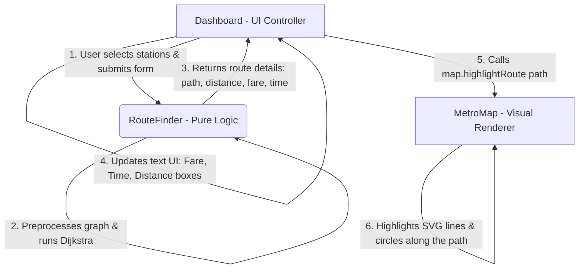

# Route Finding Architecture & Data Flow

This document details the architecture and data flow for the Metro Route Finder system. To keep the codebase clean, modular, and maintainable, we separate responsibilities into three distinct components:

1. **Dashboard (UI Controller)**: Manages user inputs, listens to form submissions, loads/saves user settings, updates textual information on the page, and coordinates communication between the map and the route finding engine.
2. **RouteFinder (Algorithmic Logic)**: Handles pure graph theory algorithms (such as Dijkstra's algorithm for the shortest path), counts interchanges, and calculates travel times and fares. It has no connection to DOM manipulation or UI rendering.
3. **MetroMap (Visual Renderer)**: Focuses exclusively on drawing the network using SVG, handling coordinates mapping, zoom/pan interactions, tooltips, and highlighting the calculated route.

---

## Architecture Flow Diagram

Below is the visual sequence of how these components interact when a user searches for a route:



---

## Detailed Data Exchange Flow

1. **User Action**: The user selects a start station and an end station on the sidebar panel, selects a route preference (e.g., shortest time or least interchanges), and clicks the "Find Route" button.
2. **Dashboard Interception**: The `Dashboard` intercepts the form submission, prevents default browser behavior, fetches the input values, and calls the `RouteFinder` utility.
   ```javascript
   const routeInfo = this.#routeFinder.findRoute(startStation, endStation, routeType);
   ```
3. **Route Search**: The `RouteFinder` runs Dijkstra's search algorithm on the preprocessed graph network and calculates:
   - **Path**: A sequential list of station names/IDs representing the path.
   - **Total Distance**: Combined track distance in kilometers.
   - **Total Fare**: Calculated based on the fare rules and distance slabs.
   - **Total Time**: Estimated travel time.
   - **Interchanges**: The count of line transfers.
4. **UI Update**: `Dashboard` receives the response object and updates the HTML overview panel fields (e.g., `.total_station`, `.time`, `.fare_amount`, `.distance`) with the calculated values.
5. **Path Highlight**: `Dashboard` instructs the map renderer to highlight the path visually:
   ```javascript
   this.#mapObj.highlightRoute(routeInfo.path);
   ```
6. **Rendering**: `MetroMap` queries the corresponding SVG line and station elements along the path and updates their styles (e.g., increasing stroke-width, adding shadow, or lowering opacity for non-route lines) to highlight the route.
