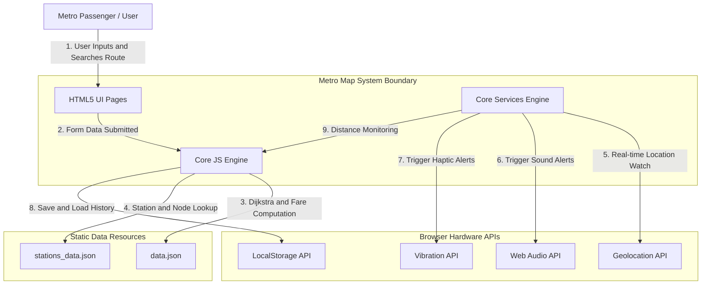

# 1. System Context Diagram (सिस्टम कॉन्टेक्स्ट डायग्राम)

यह दस्तावेज़ **Metro Map & Route Finder** प्रोजेक्ट के **System Context Diagram** और उसकी विस्तृत हिन्दी व्याख्या को दर्शाता है। 

यह डायग्राम दिखाता है कि हमारा सिस्टम किस प्रकार बाहरी उपयोगकर्ताओं (Passengers), ब्राउज़र हार्डवेयर APIs (`Geolocation API`, `Web Audio API`, `Vibration API`), `LocalStorage` और स्टैटिक JSON डाटा फ़ाइलों के साथ इंटरैक्ट करता है।

---

## 📐 System Context Diagram (Mermaid)

---

## 📝 विस्तृत हिन्दी व्याख्या (Detailed Explanation)

### 1. सिस्टम की सीमा (System Boundary):
**Metro Map & Route Finder System** एक शुद्ध **Client-Side Progressive Web Application** है। इसमें कोई बैकएंड API या सर्वर-साइड डेटाबेस नहीं है; सभी गणनाएँ (Routing, Fare, Map Rendering, Alarm Logic) सीधे उपयोगकर्ता के ब्राउज़र के अंदर निष्पादित (execute) होती हैं।

### 2. यूज़र (Actor):
- **Metro Passenger**: वह व्यक्ति जो मेट्रो का सफर कर रहा है या योजना बना रहा है। वह शुरुआती स्टेशन (Source) और गंतव्य स्टेशन (Destination) चुनता है, मैप देखता है, अलार्म सेट करता है या स्टेशन की जानकारी खोजता है।

### 3. बाहरी ब्राउज़र APIs (External Hardware Interfaces):
- **Geolocation API (`navigator.geolocation`)**: यात्री की वर्तमान स्थिति (Latitude/Longitude) को वॉच करता है ताकि लक्ष्य स्टेशन से दूरी निकाली जा सके।
- **Web Audio API & Audio Element**: अलार्म बजने पर विभिन्न ध्वनियाँ (`beep`, `chime`, `siren` या कस्टम `MP3`) उत्पन्न करता है।
- **Vibration API (`navigator.vibrate`)**: अलार्म बजने पर विभिन्न वाइब्रेशन पैटर्न्स (`short`, `long`, `sos`, `continuous`) उत्पन्न करता है।
- **LocalStorage API**: उपयोगकर्ता के हाल के खोज इतिहास (Recent Searches) और सेटिंग्स को स्थानीय रूप से सहेजता है।

### 4. डाटा रिसोर्सेज (Static JSON Files):
- **`data/data.json`**: नेटवर्क जानकारी (`DMRC`, `NMRC`, `Rapid Metro`), नेटवर्क स्पीड, हॉल्ट टाइम और किराए की दरें (`dmrc_standard` डिस्टेंस स्लैब्स) शामिल करता है।
- **`data/stations_data.json`**: सभी स्टेशनों के नाम, निर्देशांक (Coordinates), लाइन कनेक्टिविटी, वॉकवे दूरी और प्लेटफॉर्म मैपिंग शामिल करता है।

---

> **💡 Note (सुधार / भविष्य के सुझाव):**
> 1. **PWA & Offline Caching (Service Worker)**: वर्तमान में `data.json` और `stations_data.json` को `fetch()` द्वारा नेटवर्क से लोड किया जाता है। यदि इंटरनेट कनेक्शन न हो तो पहली बार पेज खुलने पर ऐप काम नहीं करेगा। Service Worker और Cache Storage जोड़ने से यह ऐप 100% ऑफ़लाइन काम कर सकेगा।
> 2. **Real-time Live Metro API Integration**: वर्तमान में ट्रेन शेड्यूल और स्पीड अनुमानित (calculated static) हैं। भविष्य में Live Metro Systems (GTFS-RT) API जोड़ने से वास्तविक समय की ट्रेन लोकेशन दिखाई जा सकेगी।
