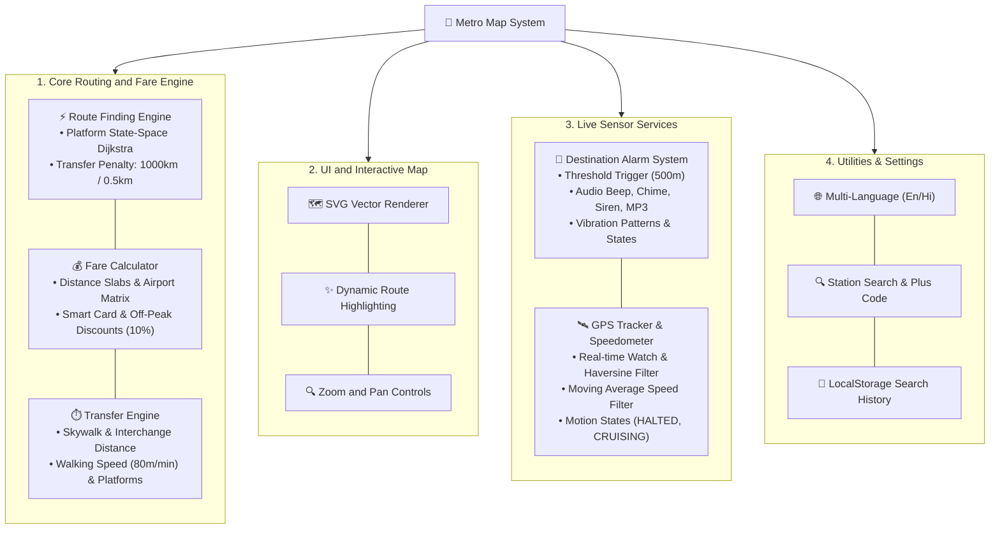

# 2. Feature Map (फीचर मैप)

यह दस्तावेज़ **Metro Map & Route Finder** प्रोजेक्ट के सभी मुख्य मॉड्यूल और फीचर्स को माइंडमैप एवं विस्तृत देवनागरी (हिन्दी) व्याख्या के साथ प्रस्तुत करता है।

---

## 🗺️ Feature Map Diagram (Mermaid)

---

## 📝 विस्तृत हिन्दी व्याख्या (Detailed Feature Breakdown)

### 1. Route Finding Engine (रूट फाइंडिंग इंजन):
- **State-Space Dijkstra Algorithm**: यह केवल स्टेशनों के बीच ही नहीं, बल्कि प्लेटफॉर्म-लाइन लेवल (`stationId-line`) पर ग्राफ सर्च चलाता है।
- **Transfer Penalty System**: 
  - `leastTransfers` मोड में हर लाइन चेंज पर **1000 किमी** की पेनल्टी लगाई जाती है ताकि न्यूनतम इंटरचेंज वाला रास्ता मिले।
  - `shortestDistance` मोड में अनावश्यक ट्रांसफर रोकने के लिए **0.5 किमी** की पेनल्टी जोड़ी जाती है।
- **Fare Calculator**: `data.json` के नियमों के अनुसार 4 प्रकार के किराये कैलकुलेट करता है (Token Fare, Smart Card Fare, Off-Peak Fare, Off-Peak Smart Card Fare)। एयरपोर्ट एक्सप्रेस लाइन के लिए डायरेक्ट स्टेशन-पेयर मैट्रिक्स का उपयोग करता है।
- **Transfer & Platform Matching**: इंटरचेंज स्टेशनों पर टर्मिनल स्टेशन की दिशा के अनुसार सही प्लेटफॉर्म नंबर बताता है।

### 2. Interactive Metro Map (इंटरएक्टिव मेट्रो मैप):
- **SVG Map Renderer**: पूरे मेट्रो नेटवर्क को SVG Shape (Lines, Circles) के रूप में रेंडर करता है।
- **Dynamic Route Highlighting**: सर्च किए गए रूट के पाथ को विजुअली बोल्ड/हाइलाइट करता है और बाकी लाइनों को डिम करता है।

### 3. Destination Alarm System (डेस्टिनेशन अलार्म सिस्टम):
- जब ट्रेन लक्ष्य स्टेशन से तय की गई थ्रेशोल्ड दूरी (उदा. 500 मीटर) के अंदर पहुँचती है, तो अलार्म स्वचालित रूप से बजने लगता है।
- इसमें 4 साउंड ऑप्शंस (`beep`, `chime`, `siren`, `mp3`) और 4 वाइब्रेशन पैटर्न्स (`short`, `long`, `sos`, `continuous`) दिए गए हैं।

### 4. GPS Tracker & Train Speedometer (जीपीएस ट्रैकर और स्पीडोमीटर):
- **GpsTracker**: रियल-टाइम GPS लोकेशन को वॉच करता है और `Haversine Formula` से दूरी मापता है। low accuracy (>100m) वाले सिग्नल को फ़िल्टर करता है।
- **Train Speedometer**: जीपीएस स्पीड में फ्लक्चुएशन रोकने के लिए **Moving Average Filter** (विंडो साइज 5) लगाता है और गति के आधार पर स्थिति तय करता है कि ट्रेन खड़ी है या चल रही है (`HALTED`, `DEPARTING`, `CRUISING`)।

### 5. Utilities & i18n (उपयोगिताएँ एवं बहुभाषी सपोर्ट):
- **i18n**: English और हिन्दी भाषा बदलने का विकल्प।
- **LocalStorage History**: हाल की खोजों (Recent Searches) को सहेजना।

---

> **🚨 Warning (सुधार और एन्कैप्सुलेशन सुझाव):**
> 1. **Public Class Variable Violation in AlarmSystem & GpsTracker**:
>    `AlarmSystem` और `GpsTracker` क्लासेज में कई स्टेट वेरिएबल्स जैसे `this.state`, `this.thresholdDistance`, `this.targetCoords`, `this.isTracking` पब्लिक हैं। बाहर का कोई भी कोड `alarm.state = "RINGING"` करके स्टेट को बिना अलार्म बजाए भ्रष्ट कर सकता है। इन्हें प्राइवेट `#state`, `#thresholdDistance`, `#targetCoords` बनाना अनिवार्य होना चाहिए।
> 2. **Moving Average Buffer Optimization in Speedometer**:
>    `TrainSpeedometer.smoothSpeed()` में `this.speedHistory.shift()` और `reduce()` का इस्तेमाल किया जा रहा है। हर जीपीएस टिक पर सरणी में `shift()` करने से नई मेमोरी एलोकेशन होती है। इसकी जगह एक फिक्स्ड साइज़ सर्कुलर बफर (Circular Buffer Array) और रनिंग सम (Running Sum) का उपयोग करना कहीं अधिक फ़ास्ट और ऑप्टिमाइज़्ड होगा।
