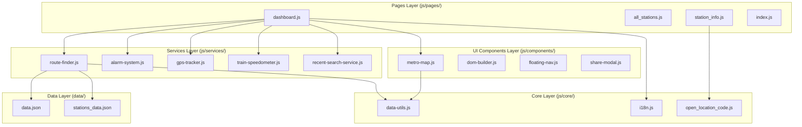

# 3. Package Diagram (पैकेज डायग्राम)

यह दस्तावेज़ **Metro Map & Route Finder** प्रोजेक्ट के कोडबेस की पैकेज संरचना (Layered Architecture) को दर्शाता है। 

प्रोजेक्ट में 4 मुख्य लेयर्स हैं: **UI and View Pages Layer**, **UI Components Layer**, **Services Layer**, और **Core Utility and Data Layer**।

---

## 📦 Package Diagram (Mermaid)

---

## 📝 विस्तृत हिन्दी व्याख्या (Detailed Layer Explanation)

### 1. Pages Layer (`js/pages/`):
यह एप्लीकेशन की प्रेजेंटेशन और व्यू कंट्रोलर लेयर है।
- **`dashboard.js`**: मुख्य डैशबोर्ड कंट्रोलर। यह यूज़र इनपुट (Source, Destination, Route Type) लेता है, `RouteFinder` सेवा को कॉल करता है और फिर `MetroMap` तथा UI एलिमेंट्स को अपडेट करता है।
- **`station_info.js` & `all_stations.js`**: स्टेशन डायरेक्टरी, प्लेटफॉर्म डिटेल्स और सर्च पेजों का प्रबंधन करते हैं।

### 2. Components Layer (`js/components/`):
यह री-यूज़ेबल (reusable) UI घटकों की लेयर है।
- **`metro-map.js`**: SVG आधारित नक्शा रेंडर करता है, ज़ूम/पैन (Zoom & Pan) इवेंट्स हैंडल करता है और रूट पाथ को हाइलाइट करता है।
- **`dom-builder.js`**: HTML DOM एलिमेंट्स को डायनेमिकली बनाने में मदद करता है।
- **`share-modal.js`**: रूट विवरण साझा (Share) करने वाला पॉपअप।

### 3. Services Layer (`js/services/`):
यह प्योर बिज़नेस लॉजिक लेयर है। इसमें कोई DOM Manipulation नहीं होना चाहिए।
- **`route-finder.js`**: ग्राफ थ्योरी (Dijkstra Algorithm), किराए की गणना और इंटरचेंज टाइमिंग निकालता है।
- **`alarm-system.js`**: ऑडियो सिंथ (Web Audio API) और वाइब्रेशन को नियंत्रित करता है।
- **`gps-tracker.js`**: जीपीएस सेंसर डेटा को वॉच करता है।
- **`train-speedometer.js`**: स्पीड में स्मूथिंग फ़िल्टर लागू करता है।

### 4. Core & Data Layer (`js/core/` & `data/`):
- **`data-utils.js`**: स्टेशनों के बीच सीधी दूरी (`getDistance`) और गणितीय गणनाएँ।
- **`i18n.js`**: अंतर्राष्ट्रीयकरण (English / Hindi डिक्शनरी आधारित अनुवाद)।
- **`data/*.json`**: नेटवर्क और स्टेशनों की स्थिर (static) डेटा फ़ाइलें।

---

> **💡 Note (पैकेज आर्किटेक्चर एवं प्राइवेट स्कोप में सुधार):**
> 1. **PriorityQueue Leak in `route-finder.js`**:
>    `PriorityQueue` क्लास वर्तमान में `route-finder.js` फ़ाइल के सबसे नीचे बिना एक्सपोर्ट किए साधारण क्लास के रूप में लिखी है। इसे एक स्वतंत्र यूटिलिटी मॉड्यूल के रूप में `js/core/priority-queue.js` में होना चाहिए ताकि अन्य सर्विसेज़ भी इसका लाभ उठा सकें।
> 2. **Tightly-Coupled DOM References in Services**:
>    `TrainSpeedometer` क्लास में `updateDisplay()` मेथड सीधे `document.getElementById("speed-value")` को एक्सेस करता है। सर्विस लेयर में सीधे HTML DOM एलिमेंट को खोजना (hardcode element lookup) आर्किटेक्चरल उल्लंघन (Clean Architecture Violation) है। UI का काम व्यू पेजों/कम्पोनेंट्स का होना चाहिए, न कि बैकएंड सर्विस का।
