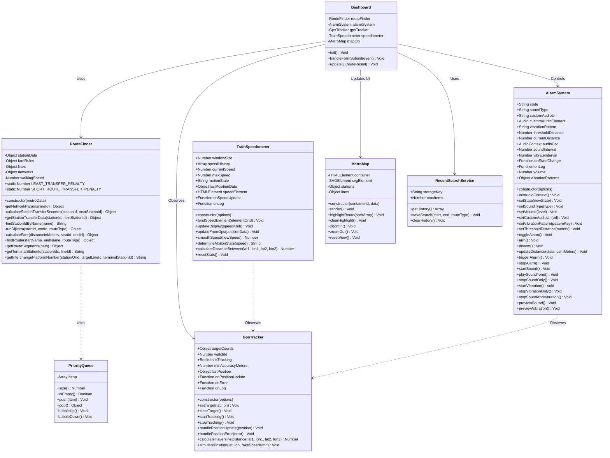

# 4. UML Class Diagram (यूएमएल क्लास डायग्राम)

यह दस्तावेज़ **Metro Map & Route Finder** के ऑब्जेक्ट ओरिएंटेड आर्किटेक्चर (ES6 Classes) को दर्शाता है। 

इसमें सभी मुख्य क्लासेज, उनके Attributes, Methods, Visibility (`+` Public, `-` Private) और आपसी सम्बंधों (Relationships) का पूर्ण चित्र प्रस्तुत किया गया है।

---

## 🏛️ UML Class Diagram (Mermaid)

---

## 📝 विस्तृत हिन्दी व्याख्या (Detailed Class Breakdown)

### 1. `RouteFinder` (ग्राफ एवं किराया गणना इंजन):
- **प्राइवेट फ़ील्ड्स (`-`)**: `stationData`, `fareRules`, `lines`, `networks`, `walkingSpeed` को बाहरी बदलावों से पूरी तरह सुरक्षित रखा गया है।
- **मुख्य मेथड्स**:
  - `findRoute(startName, endName, routeType)`: Dijkstra एल्गोरिदम चलाकर पूरा रूट, समय, किराया और इंटरचेंज रिटर्न करता है।
  - `getInterchangePlatformNumber(...)`: प्लेटफॉर्म नंबर निकालने के लिए टर्मिनल स्टेशन की दिशा मैच करता है।

### 2. `AlarmSystem` (अलार्म साउंड एवं वाइब्रेशन इंजन):
- **पब्लिक फ़ील्ड्स**: `state`, `soundType`, `vibrationPattern`, `thresholdDistance`, `currentDistance` आदि।
- **मुख्य मेथड्स**: `arm()`, `disarm()`, `updateDistance()`, `triggerAlarm()`, `stopAlarm()`।

### 3. `GpsTracker` (जीपीएस ट्रैकिंग):
- `startTracking()` द्वारा `navigator.geolocation.watchPosition` चालू करता है।
- `calculateHaversineDistance()` द्वारा पृथ्वी की वक्रता (sphere curvature) के आधार पर दो Lat/Lon बिंदुओं के बीच सीधी दूरी निकालता है।

---

> **🚨 Warning (कोड एनकैप्सुलेशन एवं सुरक्षा संबंधी गंभीर समीक्षा):**
> 1. **Lack of Private Properties (`#`) in `AlarmSystem`**:
>    `RouteFinder` में बहुत सुंदरता से `#private` फ़ील्ड्स का उपयोग किया गया है, परन्तु `AlarmSystem` में **सारे वेरिएबल्स पब्लिक (`this.state`, `this.thresholdDistance`, `this.vibrateInterval`)** छोड़ दिए गए हैं! 
>    *जोखिम (Risk)*: बाहरी कोड बिना वेरिफिकेशन के `alarm.state = "RINGING"` कर सकता है या `audioCtx` को नल (null) सेट कर सकता है, जिससे ऐप क्रैश हो जाएगा।
> 2. **Lack of Private Properties in `GpsTracker` & `TrainSpeedometer`**:
>    `GpsTracker` में `watchId`, `isTracking`, `targetCoords` सब पब्लिक हैं। `stopTracking()` का उपयोग करने के बजाय कोई बाहरी स्क्रिप्ट `gps.watchId = null` सेट कर सकती है, जिससे बैकग्राउंड में जीपीएस चलता रहेगा और बैटरी ड्रेन होगी (Memory/Sensor Leak)।
> 3. **Static Helper Isolation**:
>    `PriorityQueue` क्लास स्वतंत्र एक्सपोर्ट के रूप में मौजूद नहीं है; वह `route-finder.js` की फ़ाइल स्कोप में ही बंद है।
