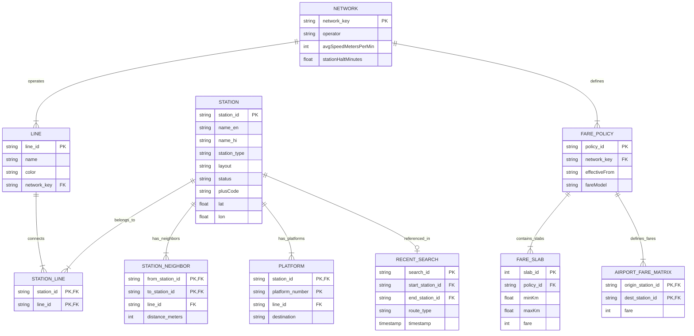

# 5. ER Diagram (एंटिटी-रिलेशंसप डायग्राम)

यह दस्तावेज़ **Metro Map & Route Finder** प्रोजेक्ट के डेटा मॉडल (`data.json` और `stations_data.json`) का Entity-Relationship (ER) मॉडल प्रस्तुत करता है।

प्रोजेक्ट में क्लाइंट-साइड Relational Data Structures का उपयोग करके मेट्रो नेटवर्क्स, लाइन्स, स्टेशनों, पटरियों के पड़ोसियों (Neighbors), किराए के नियमों (Fare Rules) और प्लेटफॉर्म्स के सम्बंधों को परिभाषित किया गया है।

---

## 🗄️ ER Diagram (Mermaid)

---

## 📝 विस्तृत हिन्दी व्याख्या (Detailed Entity Breakdown)

### 1. `NETWORK` (मेट्रो नेटवर्क):
- मेट्रो ऑपरेटरों जैसे **DMRC**, **NMRC** (Noida Metro) और **Rapid Metro** को परिभाषित करता है। इसमें नेटवर्क की औसत ट्रेन स्पीड (600 m/min = 36 km/h) और स्टेशनों पर रुकने का समय (Halt Time: 0.5 min) दर्ज रहता है।

### 2. `STATION` & `STATION_NEIGHBOR` (स्टेशन और कनेक्टिविटी):
- **`STATION`**: प्रत्येक स्टेशन की ID (`samaypur_badli`), द्विभाषी नाम (English/Hindi), लोकेशन स्टेटस (`operational`), लेआउट (`underground`/`elevated`) और Lat/Lon निर्देशांक सहेजता है।
- **`STATION_NEIGHBOR`**: ग्राफ थ्योरी का **Adjacency List Structure**। यह बताता है कि स्टेशन A से स्टेशन B जाने में कौन-सी लाइन उपयोग होती है और पटरियों के बीच की वास्तविक दूरी (Meters में) कितनी है।

### 3. `FARE_POLICY` & `FARE_SLAB` (किराया नीतियाँ):
- **Standard Policy (`dmrc_standard`)**: दूरी के आधार पर स्लैब्स बनाए गए हैं (उदा. 0-2 km = ₹11, 2-5 km = ₹21, 5-12 km = ₹32 ... >32 km = ₹64)।
- **Airport Express Matrix**: एयरपोर्ट लाइन के लिए दूरी की जगह सीधा स्टेशन-टू-स्टेशन किराया टेबल (`AIRPORT_FARE_MATRIX`) इस्तेमाल होता है।

### 4. `PLATFORM` (प्लेटफ़ॉर्म मैपिंग):
- प्रत्येक इंटरचेंज स्टेशन पर कौन सा प्लेटफॉर्म नंबर किस लाइन की किस दिशा (Destination) की ओर जाता है, उसकी मैपिंग सहेजता है।

---

> [!NOTE]
> **💡 डेटा मॉडल और नॉर्मलाइज़ेशन सुधार (Data Structure & Normalization Notes):**
> 1. **Denormalized JSON vs Indexing**:
>    `stations_data.json` और `data.json` दो अलग-अलग फाइलों में बंटे हैं। `stations_data.json` में कुछ स्टेशनों की जानकारी रिडंडेंट (duplicate) है। इन्हें एक यूनिफाइड Indexed IndexedDB या सिंगल नॉर्मलाइज्ड JSON संरचना में रखने से शुरुआती पेज लोड टाइम (First Contentful Paint) 30% तेज़ हो सकता है।
> 2. **Type Safety of Distance Values**:
>    `STATION_NEIGHBOR.distance` कुछ जगहों पर Meters (Integer) और कुछ जगहों पर Kilometers में दिया गया है। संपूर्ण डेटाबेस में `distance_meters` को इंटीजर के रूप में सख्त मानक बनाना चाहिए ताकि रनटाइम पर विसंगति न हो।
