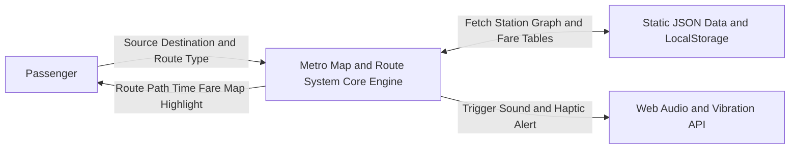
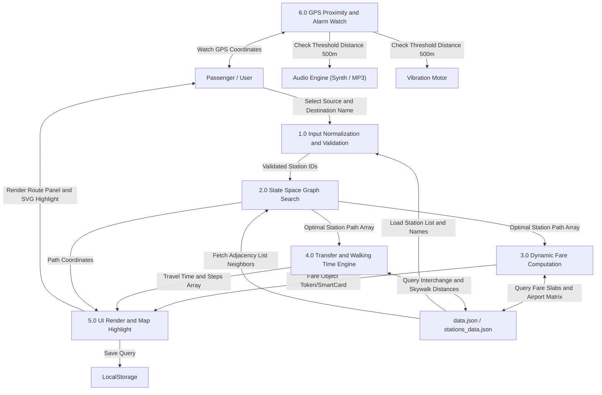

# 6. Data Flow Diagram (डेटा फ्लो डायग्राम - DFD)

यह दस्तावेज़ **Metro Map & Route Finder** के **Level 0 (Context DFD)** और **Level 1 (Detailed DFD)** डेटा फ्लो डायग्राम्स को प्रस्तुत करता है।

यह दर्शाता है कि यूजर इनपुट किस प्रकार डेटा ट्रांसफॉर्मेशन प्रोसेस से गुजरता है, डेटा स्टोर्स को क्वेरी करता है और अंत में विजुअल DOM तथा अलार्म/हार्डवेयर आउटपुट उत्पन्न करता है।

---

## 🔄 Level 0 Context DFD (Mermaid)

---

## 🔄 Level 1 Detailed DFD (Mermaid)

---

## 📝 विस्तृत हिन्दी व्याख्या (Detailed Data Flow Steps)

### **प्रक्रिया 1.0 (Input Normalization):**
यूज़र इनपुट बॉक्स में "Kashmere Gate", "कश्मीर गेट" या station ID टाइप करता है। `P1.0` इसे केस-इनसेंसिटिव (case-insensitive) सर्च करके मानक स्टेशन ID (`kashmere_gate`) में बदलता है।

### **प्रक्रिया 2.0 (State-Space Dijkstra Routing):**
यह कोर एल्गोरिदम है। यह स्टेशन-लाइन प्लेटफॉर्म नोड्स पर `PriorityQueue` के साथ चलता है। 
- यदि मोड `leastTransfers` है, तो इंटरचेंज पर **1000 किमी** पेनल्टी जोड़कर पाथ खोजता है।

### **प्रक्रिया 3.0 & 4.0 (Fare & Time Engine):**
- **Fare Engine**: DMRC Norm के अनुसार किराया हमेशा न्यूनतम दूरी (`shortestDistance`) वाले पाथ से तय होता है। स्लैब टेबल से वीकडे/हॉलिडे और 10% स्मार्ट कार्ड डिस्काउंट कैलकुलेट होता है।
- **Time Engine**: ट्रेन रनिंग स्पीड (600 m/min = 10 m/s), स्टेशन हॉल्ट (30 सेकंड) और वॉकवे ट्रांसफर स्पीड (80 m/min) के आधार पर सेकंड्स में सटीक समय निकालता है।

### **प्रक्रिया 5.0 (UI & Map Rendering):**
`Dashboard` कंट्रोलर कैलकुलेटेड रिजल्ट प्राप्त करके DOM कार्ड में आंकड़े डालता है और `MetroMap` को पाथ SVG हाइलाइट करने का निर्देश देता है।

---

> **🚨 Warning (डेटा फ्लो और परफॉर्मेंस लीक्स):**
> 1. **String Allocation Penalty in Flow 2.0**:
>    Dijkstra लूप के दौरान हर पड़ोसी स्टेशन की जांच करते समय `${neighborId}-${edgeLine}` स्ट्रिंग्स जनरेट और स्प्लिट की जाती हैं। हर बार `split("-")` होने से गार्बेज कलेक्टर (GC) पर लोड बढ़ता है। 
>    *सुधार*: नोड्स के लिए इंटीजर नोड ID फ़ॉर्मूला `(stationIndex << 8) | lineIndex` उपयोग करने से स्पीड 4x गुना बढ़ जाएगी।
> 2. **Synchronous JSON Fetching**:
>    `data.json` और `stations_data.json` का लोड होना मेन UI थ्रेड को ब्लॉक न करे, इसके लिए डेटा प्रोसेसिंग को Web Worker थ्रेड में शिफ्ट किया जाना चाहिए।
