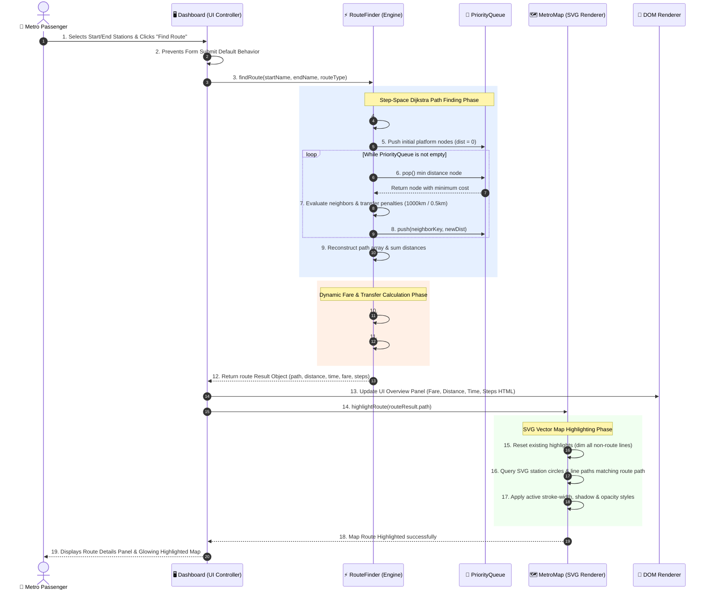

# 7. Sequence Diagram (सीक्वेंस डायग्राम)

यह दस्तावेज़ यूज़र द्वारा रूट खोजने (Find Route) की क्रिया पर निष्पादित होने वाले **Step-by-Step Execution Sequence** को दर्शाता है।

यह डायग्राम दिखाता है कि **User**, **Dashboard UI Controller**, **RouteFinder Engine**, **PriorityQueue**, **MetroMap Component** और **DOM Renderer** के बीच किस क्रम (chronological order) में मैसेजेस और फ़ंक्शन कॉल्स पास होते हैं।

---

## ⏱️ Sequence Diagram (Mermaid)

---

## 📝 विस्तृत हिन्दी व्याख्या (Detailed Execution Lifecycle)

1. **इवेंट इंटरसेप्शन (Event Interception)**:
   जब यूज़र "Find Route" बटन दबाता है, तो `Dashboard.js` का फॉर्म सबमिट लिसनर ट्रिगर होता है। वह ब्राउज़र का डिफ़ॉल्ट पेज रीलोड रोकता है।

2. **नेम टू ID रिज़ॉल्यूशन (Name to ID Resolution)**:
   `RouteFinder` सबसे पहले यूज़र द्वारा टाइप किए गए नामों (English / Hindi) को `data.json` के यूनिक स्टेशन IDs में रिज़ॉल्व करता है।

3. **स्टेट-स्पेस डिक्सट्रा ग्राफ सर्च (Dijkstra Algorithm)**:
   - `PriorityQueue` से न्यूनतम लागत वाले प्लेटफॉर्म नोड को निकाला जाता है।
   - यदि यूज़र ने **"Least Transfers"** चुना है, तो हर लाइन चेंज पर **1000 किमी** पेनल्टी जुड़ती है।
   - यदि यूज़र ने **"Shortest Distance"** चुना है, तो केवल **0.5 किमी** पेनल्टी जुड़ती है।

4. **फेयर एवं टाइम कैलकुलेटर (Fare & Time Engine)**:
   - DMRC के नियमानुसार किराया हमेशा न्यूनतम दूरी (`shortestDistance`) पाथ से तय होता है।
   - वॉकवे और इंटरचेंज स्टेशनों पर पैदल चलने का समय (Walking Speed 80 m/min) जोड़ा जाता है।

5. **DOM & SVG मैप हाइलाइट (Rendering)**:
   - `Dashboard` प्राप्त डेटा को टेक्स्ट बॉक्स (Fare, Distance, Time, Steps) में भरता है।
   - `MetroMap` पूरे SVG में से केवल रूट वाली लाइनों और सर्कल्स का CSS opacity और stroke-width बढ़ाकर उन्हें चमकदार/हाइलाइट करता है।

---

> [!NOTE]
> **💡 थ्रेड ब्लॉकिंग और इवेंट लिसनर्स में सुधार (Thread & Performance Notes):**
> 1. **UI Blocking During Heavy Dijkstra Search**:
>    Dijkstra लूप मेन UI थ्रेड में चलता है। यद्यपि वर्तमान मेट्रो नेटवर्क छोटा है, पर बड़े नेटवर्क पर 50ms से ज्यादा का समय लगने पर UI फ्रीज (Frame Drop) हो सकता है। इसे Web Worker या `requestIdleCallback` में निष्पादित करना चाहिए।
> 2. **Async MetroMap Highlight Signal**:
>    `MetroMap.highlightRoute()` को `requestAnimationFrame()` के अंदर चलाना चाहिए ताकि DOM मैनिपुलेशन के समय स्मूथ ज़ूम/पैन और नो-लैग (Lag-free) एनीमेशन मिले।
