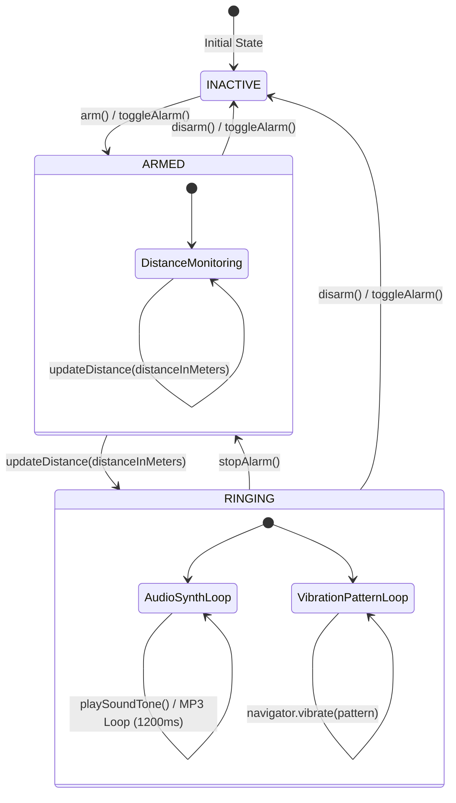

# 8. State Diagram - Alarm System (स्टेट डायग्राम - डेस्टिनेशन अलार्म)

यह दस्तावेज़ **Destination Alarm System** (`js/services/alarm-system.js`) के State Machine Lifecycle को स्टेट डायग्राम तथा विस्तृत देवनागरी (हिन्दी) व्याख्या के साथ दर्शाता है।

अलार्म सिस्टम 3 मुख्य अवस्थाओं (States) के बीच ट्रांज़िशन करता है: **`INACTIVE`**, **`ARMED`**, और **`RINGING`**।

---

## 🔄 Alarm System State Diagram (Mermaid)

---

## 📝 विस्तृत हिन्दी व्याख्या (Detailed State Lifecycles)

### 1. `INACTIVE` State (निष्क्रिय अवस्था):
- यह अलार्म की शुरुआती (default) अवस्था है। इस समय न तो जीपीएस दूरी मॉनिटर की जाती है और न ही कोई साउंड या वाइब्रेशन बजता है।
- **ट्रांज़िशन (Transition)**: जब उपयोगकर्ता अलार्म ऑन (Arm) करता है, तो `initAudioContext()` कॉल होकर ब्राउज़र का Web Audio Context अनलॉक होता है और स्टेट **`ARMED`** बन जाती है।

### 2. `ARMED` State (सशक्त / मॉनिटरिंग अवस्था):
- इस अवस्था में सिस्टम लगातार `updateDistance(distanceInMeters)` मेथड के ज़रिए जीपीएस से प्राप्त वर्तमान दूरी को चेक करता रहता है।
- **कंडीशन (Condition)**: जब तक दूरी थ्रेशोल्ड (उदा. 500 मीटर) से अधिक रहती है, सिस्टम चुपचाप दूरी अपडेट करता रहता है।
- **ट्रिगर (Trigger)**: जैसे ही दूरी `currentDistance <= thresholdDistance` (500m) होती है, स्टेट तुरंत बदलकर **`RINGING`** हो जाती है और `triggerAlarm()` ट्रिगर होता है।

### 3. `RINGING` State (अलार्म बजने की अवस्था):
- इस अवस्था में दो बैकग्राउंड लूप एक्टिव हो जाते हैं:
  1. **Audio Engine**: सेट किए गए प्रकार के अनुसार ध्वनियाँ निकालता है:
     - `beep`: High Beep Sine Pulse (880 Hz, 0.3s)
     - `chime`: Metro Double Chime (C5 -> E5 -> G5, 1200ms loop)
     - `siren`: Sweeping Siren Tone (400 Hz -> 900 Hz -> 400 Hz)
     - `mp3`: Custom Audio HTML5 Element Loop
  2. **Vibration Engine**: `navigator.vibrate` से पैटर्न्स ट्रिगर करता है (`short`, `long`, `sos`, `continuous`)।
- **ट्रांज़िशन**:
  - यदि यूज़र "Stop Alarm" बटन दबाता है, तो `stopAlarm()` कॉल होता है: साउंड और वाइब्रेशन बंद हो जाते हैं और सिस्टम वापस **`ARMED`** में आ जाता है (ताकि स्टेशन से दूर जाने पर पुनः अलर्ट रह सके)।
  - यदि यूज़र पूर्णतः ऑफ करता है, तो `disarm()` से सिस्टम वापस **`INACTIVE`** हो जाता है।

---

> **🚨 Warning (स्टेट प्रोटेक्शन एवं टाइमर लीक्स):**
> 1. **Public State Corruption Hazard**:
>    `AlarmSystem` क्लास में `this.state` वेरिएबल **पब्लिक** है (`this.state = "INACTIVE"`)। 
>    *समस्या*: यदि बाहर का कोड `alarm.state = "RINGING"` बिना `triggerAlarm()` कॉल किए सेट कर दे, तो अलार्म की स्टेट तो "RINGING" दिखेगी, परन्तु साउंड और वाइब्रेशन चालू ही नहीं होंगे! स्टेट परिवर्तन को प्राइवेट `#state` बनाकर केवल `setState()` मेथड के ज़रिए नियंत्रित किया जाना चाहिए।
> 2. **Memory & Timer Leak in Sound Intervals**:
>    `startSound()` मेथड में `setInterval` द्वारा हर 1200ms पर `playSoundTone()` कॉल होता है। यदि `startSound()` को बिना `stopSoundOnly()` चलाए दो बार कॉल कर दिया जाए, तो पुराना इंटरवल लीक (abandoned) हो जाता है और बैकग्राउंड में 2-3 अलार्म एक साथ बजने लगते हैं! 
>    *सुधार*: `startSound()` में सबसे पहले `this.stopSoundOnly()` को हमेशा कॉल करना सुरक्षित रहेगा।
