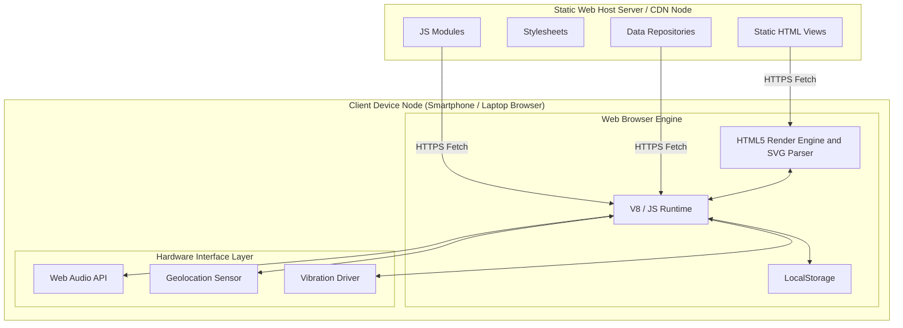

# 9. Deployment Diagram (डिप्लॉयमेंट डायग्राम)

यह दस्तावेज़ **Metro Map & Route Finder** के डिप्लॉयमेंट आर्किटेक्चर को दर्शाता है।

चूँकि यह प्रोजेक्ट एक **Client-Side Single Page / Multi-Page Static Web Application** है, इसका डिप्लॉयमेंट मॉडल दो मुख्य नोड्स में विभाजित है: **Static Web Server / CDN Hosting Node** और **Client Runtime Device Node (Browser Environment)**।

---

## 🌐 Deployment Diagram (Mermaid)

---

## 📝 विस्तृत हिन्दी व्याख्या (Detailed Architecture Deployment)

### 1. स्टैटिक वेब सर्वर / CDN नोड (Server Environments):
- ऐप को चलाने के लिए किसी जटिल Node.js, Python, या PHP बैकएंड सर्वर की आवश्यकता नहीं है। इसे किसी भी स्टैटिक होस्टिंग प्रदाता जैसे **GitHub Pages**, **Vercel**, **Netlify**, या **NGINX/Apache** पर डिप्लॉय किया जा सकता है।
- सर्वर का काम केवल HTTP/HTTPS प्रोटोकॉल के ज़रिए `.html`, `.css`, `.js` मॉड्यूल्स और `.json` डाटा फाइलों को क्लाइंट ब्राउज़र तक पहुँचाना है।

### 2. क्लाइंट ब्राउज़र रनटाइम नोड (Client Runtime Device):
- **JavaScript Engine (V8/SpiderMonkey)**: सभी एल्गोरिदम (Dijkstra, Fare Calculation, Moving Average Speed Filter) सीधे यूज़र के मोबाइल/लैपटॉप के CPU पर रन होते हैं।
- **SVG & DOM Rendering Engine**: मेट्रो मैप वेक्टर इमेज (`SVG`) के रूप में ब्राउज़र DOM के अंदर डायनेमिकली रेंडर और मैनिपुलेट होता है।
- **LocalStorage API**: यूज़र के हाल के खोज इतिहास और कस्टम सेटिंग्स को क्लाइंट के ब्राउज़र स्टोरेज में सहेजता है।

### 3. हार्डवेयर इंटरफेस लेयर (Hardware Drivers Integration):
- **Geolocation Sensor**: डिवाइस के जीपीएस चिपसेट से Lat/Lon लोकेशन डेटा प्राप्त करता है।
- **Web Audio API Engine**: साउंड कार्ड/स्पीकर के ज़रिए सिंथेसाइज़र टोन (Beep/Chime/Siren) जेनरेट करता है।
- **Vibration API Driver**: मोबाइल डिवाइस के हैप्टिक वाइब्रेशन मोटर (Vibration Motor) को कमांड देता है।

---

> **💡 Note (डिप्लॉयमेंट और सिक्योरिटी में सुधार के सुझाव):**
> 1. **HTTPS Security Requirement**:
>    `Geolocation API` और `Vibration API` आधुनिक ब्राउज़रों में केवल सुरक्षित कनेक्शन (**HTTPS**) पर ही काम करते हैं। अन-सिक्योर HTTP पर जीपीएस और वाइब्रेशन ब्लॉक हो जाते हैं। इसलिए डिप्लॉयमेंट हमेशा SSL/TLS सर्टिफिकेट के साथ होना चाहिए।
> 2. **PWA Integration for Offline First Deployment**:
>    यदि वेब ऐप में एक **`manifest.json`** और **`sw.js` (Service Worker)** जोड़ा जाए, तो उपयोगकर्ता इसे अपने मोबाइल पर एक नेटिव एंड्रॉइड/iOS ऐप की तरह इंस्टॉल (Add to Home Screen) कर सकेगा और इंटरनेट के बिना भी पूरा मेट्रो मैप इस्तेमाल कर पाएगा।
